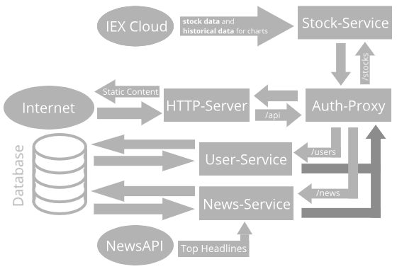

# Financial App 
This project is NOT intended for production use. The purpose of this project was to introduce me to backend development. 

## Table of Contents

- [Setup](#setup)
- [Services](#services)
- [Architecture](#architecture)
- [Contributing](#contributing)
- [License](#license)

## Setup 
Before building the app, make sure you have [Docker](https://www.docker.com/) installed. See [here](https://docs.docker.com/get-docker/) for an installtion guide.
Once you've installed Docker, follow the following steps to build the App.

Step 1:
First get all submodules needed for the app, like so:
```sh
git submodule init
```

Step 2:
Next, we have to build the frotnend like so:
```sh
cd frontend
docker image build -t financial-frontend .
```

Step 3:
To build the app with the preset values, run:
```sh
docker-compose build --parallel
```

Step 4:
No we have to add the required secrets. First create a Docker swarm like so:
```sh
docker swarm init
```

If you haven't already, open a new account with the [NewsAPI](https://www.iexcloud.io/) and [IEXCloud](https://newsapi.org/) services to get the neccessary API keys.

Using those API keys, we can create the secrets like so:
```sh
printf <your-iexcloud-key> | docker secret create iex_cloud_key .;
printf <your-csrf-key> | docker secret create csrf_key .;
printf <your-db-password> | docker secret create db_password .;
printf <your-newsapi-key> | docker secret create newsapi_key .;
printf <your-jwt-key> | docker secret create jwt_key .;
```

After creating those secrets we still need 2 more secrets for our http-server. The HTTPS certificate and certificate key. If you don't already have them,you can generate them, like so:
```sh
openssl genrsa -out site.key 2048
openssl req -new -x509 -sha256 -key site.key -out site.crt -days 3650
```

Once you generated the cert. & cert. key, add them to the docker swarm like this:
```sh
docker secret create site.key site.key;
docker secret createsite.crt site.crt;
```

Afterwards, run the following command to start the app:
```sh
docker stack deploy -c docker-compose.yml finstack
```

The app usually takes a while to fully start up. To check that all services started, run:
```sh
sudo docker service ls
```

## Services
The whole app is divided into the following 6 services:
- [http-server](http-server/README.md) acts as the first contact with the app from outside. It sends static files and sends all other traffic to the [auth-proxy](auth-proxy/README.md)
- [auth-proxy](auth-proxy/README.md) handles all routes that don't require authentication (login, register, etc.). Apart from that, it checks if the user's authenticated (has valid credentials) and if so, redirects to the needed service.
- [database](database/README.md) acts as the shared database between all services,
- [news-service](news-service/README.md) handles all routes concerning news data retrieval.
- [stock-service](stock-service/README.md) handles all routes concerning stock data retrieval.
- [user-service](user-service/README.md) handles all routes which need access to the users account (stock buying/selling, language change, etc.).

## Architecture 
The app's structures in the following way: 



## Contributing 
Pull requests are welcome. For major changes, please open an issue first to discuss what you would like to change.

Please make sure to update tests as appropriate.

## License
GNU GPLv3. Click [here](https://choosealicense.com/licenses/gpl-3.0/) or see the LICENSE file for details.